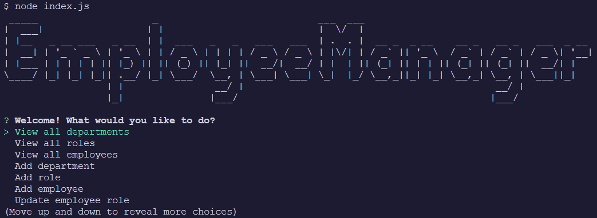

# Employee Manager

This project is a CLI application that uses Node.js and JavaScript to track a company's employees using a number of different built-in functions.

## Authors

- [Dylan Freeman](https://www.github.com/templarmanatee)

## Badges

[](https://choosealicense.com/licenses/mit/)

## Demo

https://watch.screencastify.com/v/MOksf1Z8CP0ybPUp8xuD

## Screenshots



## Deployment

To deploy this project run

```bash
  npm i
```

Create a new employees_db

Seed with the provided data.

```bash
  node index.js
```

## License

[MIT](https://choosealicense.com/licenses/mit/)

## Feedback

If you have any feedback, please reach out to me at dylan@dylanfreeman.tech
